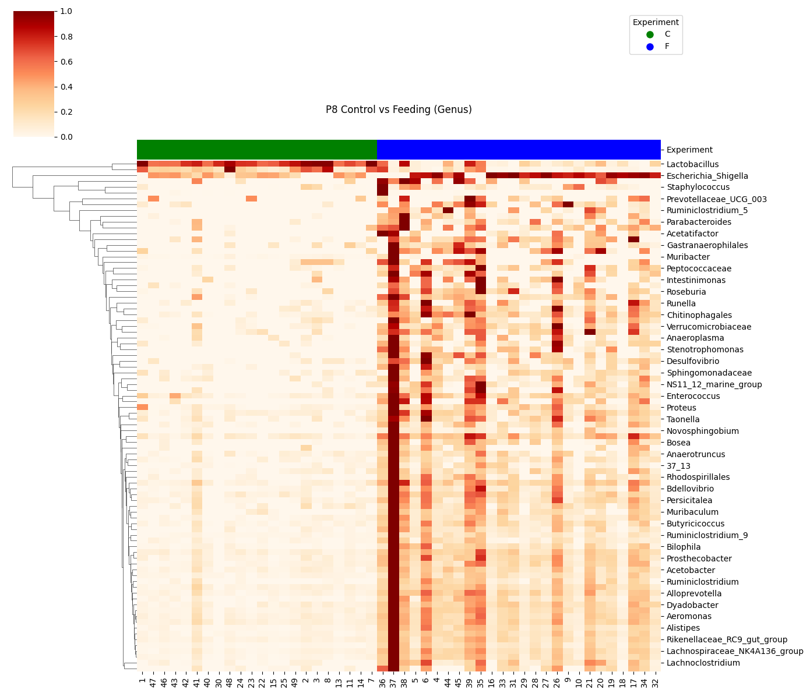

# Bioinformatic Data Analysis

## 16S rRNA Data Analysis
Use DADA2 Taxonomic Classification to generate OTU Clustering or Amplicon Sequence Variant (ASV) Identification. Use PICRUSt2 to predictethe functional potential of microbial communities based on 16S rRNA gene sequencing data. 
Use machine learning methods, LEfSe and Random Forest, to explore the signicances of different groups.
## RNA-seq Data Analysis
Read Alignment or Mapping, Quantification of Gene Expression, Normalization, Differential Expression Analysis
## VCF Data Analysis
Etract VCF data to CSV, merge CSV
## Contribution
Andres, E.M.; Earnest, K.K.; Xuan, H.; Zhong, C.; Rice, M.L.; Raza, M.H. Innovative Family-Based Genetically Informed Series of Analyses of Whole-Exome Data Supports Likely Inheritance for Grammar in Children with Specific Language Impairment. Children 2023, 10, 1119. https://doi.org/10.3390/children10071119

Benjamin L. Woolbright, Erika Abbott, Ganeshkumar Rajendran, Cuncong Zhong, Hao Xuan, Shahid Umar, John Arthur Taylor. Intersection of aging, the microbiome and inflammation in a mouse model of bladder cancer [abstract]. In: Proceedings of the American Association for Cancer Research Annual Meeting 2021; 2021 Apr 10-15 and May 17-21. Philadelphia (PA): AACR; Cancer Res 2021;81(13_Suppl):Abstract nr 2911.

Chavez-Bueno, Susana; Xuan, Hao; Umar, Shahid; Zhong, Concong; Yu, Wei; and Sampath, Venkatesh, "Neonatal Gut Microbiota Alterations and Local Inflammation Induced by Escherichia coli Infection are Modified by Lactobacillus rhamnosus Prophylaxis" (2021). Presentations. 28.
https://scholarlyexchange.childrensmercy.org/presentations/28

## Example

